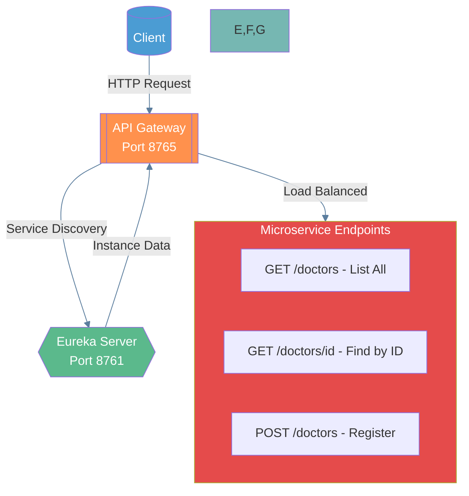
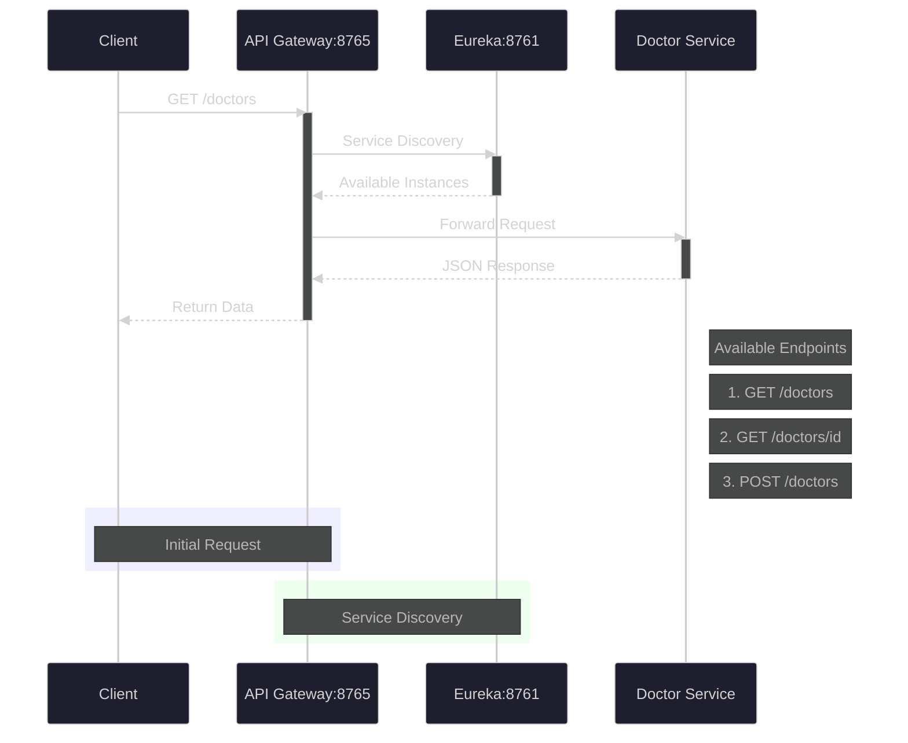

# WikiDocs
A Portal For Doctors,Clinics &amp; patients 

```mermaid
%%{init: {'theme': 'default', 'themeVariables': {
  'primaryColor': '#f0f4f8',
  'primaryBorderColor': '#394f63',
  'lineColor': '#5c7e9e'
}}}%%
graph TD
    A[("Client")] -->|HTTP Request| B[["API Gateway<br/>Port 8765"]]
    B -->|Service Discovery| C{{"Eureka Server<br/>Port 8761"}}
    C -->|Instance Data| B
    B -->|Load Balanced| D[["Doctor Service"]]
    
    subgraph D["Microservice Endpoints"]
        E["GET /doctors - List All"]
        F["GET /doctors/id - Find by ID"]
        G["POST /doctors - Register"]
    end

    style A fill:#4b9cd3,color:white
    style B fill:#ff914d,color:white
    style C fill:#5bb98c,color:white
    style D fill:#e54b4b,color:white
    style E,F,G fill:#76b7b2,color:#333
```

```mermaid
%%{init: {'theme': 'dark', 'themeVariables': {'actorBkg': '#1e1e2e'}}}%%
sequenceDiagram
    participant C as Client
    participant A as API Gateway:8765
    participant E as Eureka:8761
    participant D as Doctor Service

    C->>A: GET /doctors
    activate A
    A->>E: Service Discovery
    activate E
    E-->>A: Available Instances
    deactivate E
    A->>D: Forward Request
    activate D
    D-->>A: JSON Response
    deactivate D
    A-->>C: Return Data
    deactivate A

    %% Endpoints documentation
    Note right of D: Available Endpoints
    Note right of D: 1. GET /doctors
    Note right of D: 2. GET /doctors/id
    Note right of D: 3. POST /doctors

    %% Colored phases
    rect rgba(100,100,255,0.1)
        Note over C,A: Initial Request
    end
    rect rgba(100,255,100,0.1)
        Note over A,E: Service Discovery
    end
```
